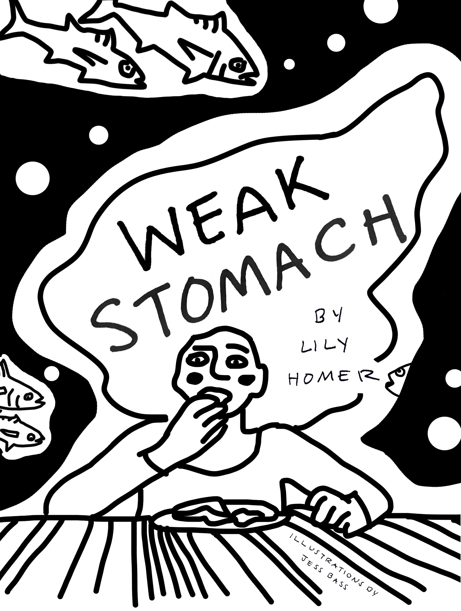
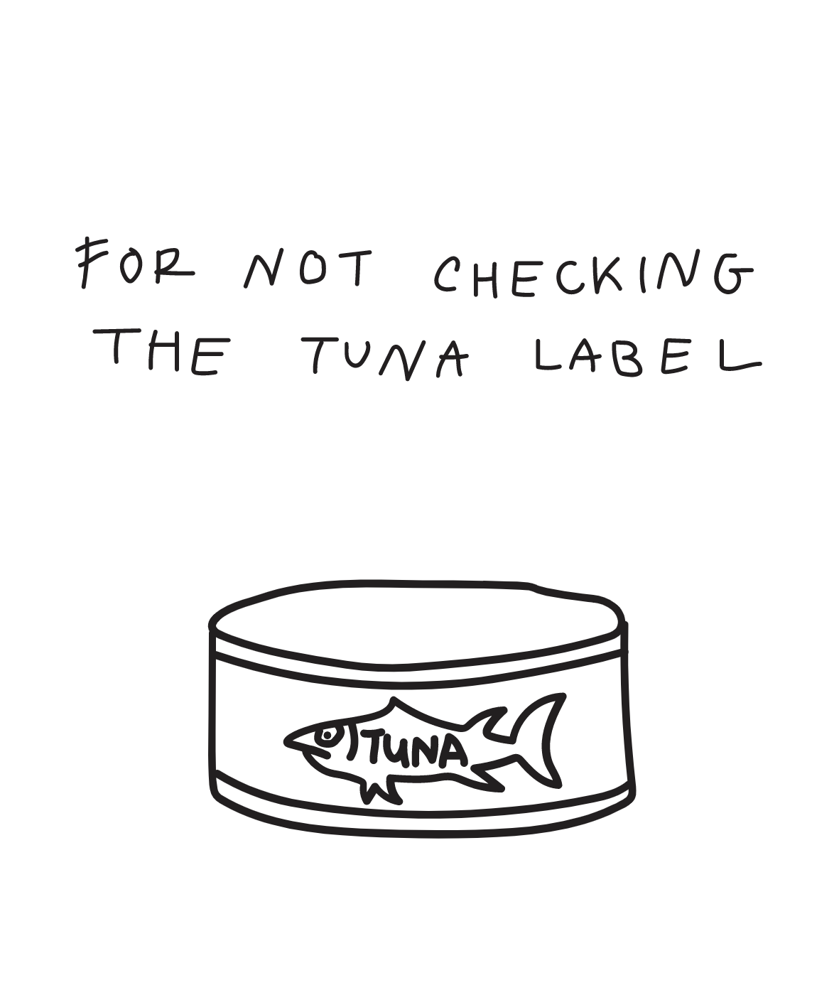
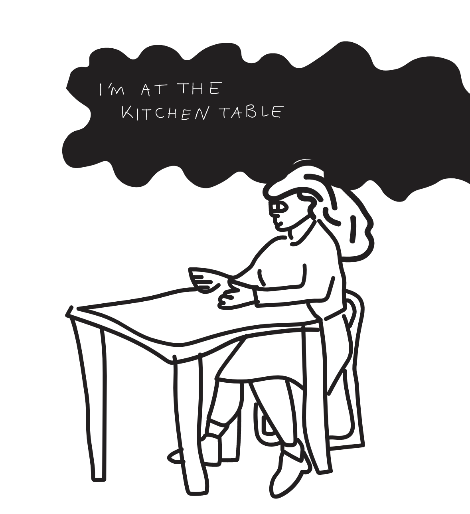
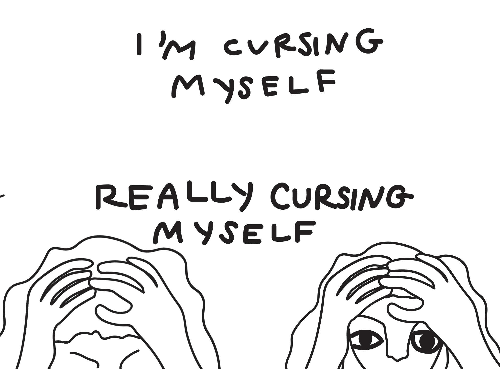

# weak stomach

Weak Stomach is a digital translation of a graphic novel written by Lily Homer and illustrated by Jess Bass.
It's about anxiety, absurdity, and bad fish.

This repository is in progress. The pages represented currently account for a fraction of the original story. This work is ongoing.

Visit site:
https://lilydhomer.github.io/weakstomach/

If you'd like to but a copy of the original book (it's pretty great), head here:
https://www.lilyhomer.com/shop

